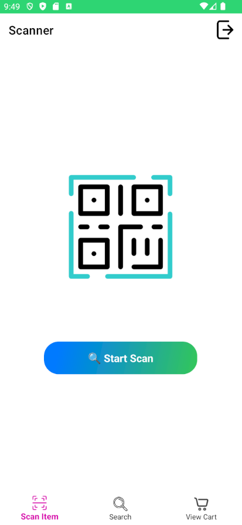
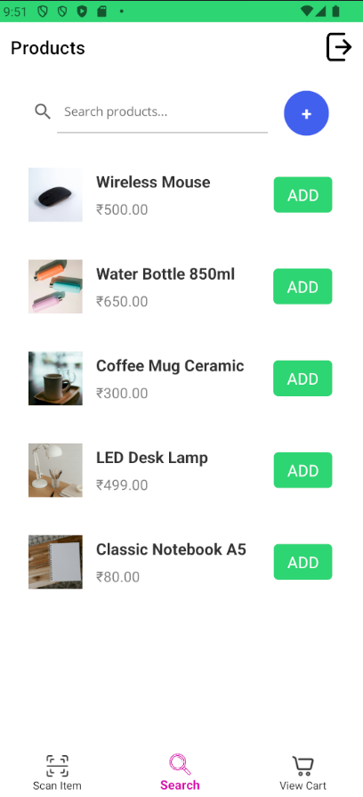
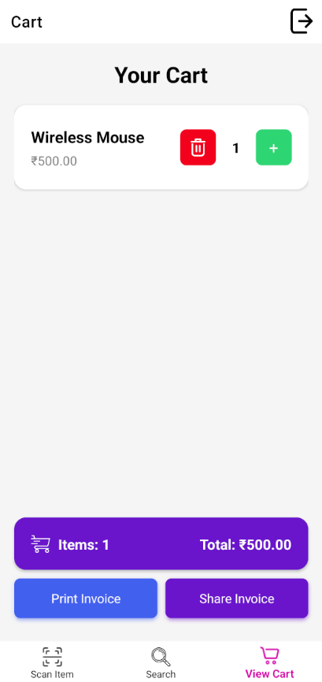
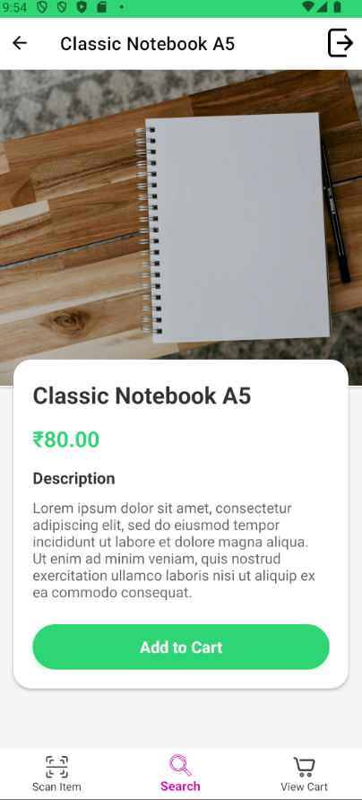

# MAUI Scanner App

A .NET MAUI-based scanner application that allows users to scan barcodes, manage products, and print receipts using an Epson TM-m30III thermal printer.

## Features

- Barcode scanning
- Product management (Add, Edit, Delete)
- Shopping cart functionality
- Receipt printing with Epson TM-m30III
- PDF generation and sharing
- Image upload to Cloudinary
- Search functionality

## Prerequisites

- Visual Studio 2022 17.8 or later
- .NET 8.0 SDK
- MAUI workload installed
- Android SDK (for Android development)
- Epson ePOS SDK for Android
- Active internet connection
- Cloudinary account (for image uploads)

## App Screenshots

<table>
  <tr>
    <td align="center" width="25%">
      <br/>
      <b>Scanner</b>
    </td>
    <td align="center" width="25%">
      <br/>
      <b>Products</b>
    </td>
    <td align="center" width="25%">
      <br/>
      <b>Cart</b>
    </td>
    <td align="center" width="25%">
      <br/>
      <b>Details</b>
    </td>
  </tr>
</table>

## Project Setup

1. **Install Required Workloads**:

```powershell
dotnet workload install maui
```

2. **Clone the Repository**:

```powershell
git clone <repository-url>
cd scannermaui
```

3. **Restore Dependencies**:

```powershell
dotnet restore
```

4. **Configure Epson ePOS SDK**:

- Download Epson ePOS SDK for Android
- Add the following to your Android Manifest:

```xml
<uses-permission android:name="android.permission.INTERNET" />
<uses-permission android:name="android.permission.ACCESS_NETWORK_STATE" />
<uses-permission android:name="android.permission.ACCESS_WIFI_STATE" />
```

5. **Configure Cloudinary**:

- Create a `appsettings.json` file in the project root:

```json
{
  "Cloudinary": {
    "CloudName": "your_cloud_name",
    "ApiKey": "your_api_key",
    "ApiSecret": "your_api_secret"
  }
}
```

## Printer Setup

1. **Network Configuration**:

- Ensure your Epson TM-m30III printer is connected to the same network as your device
- Configure printer's static IP address through printer settings

2. **Printer Testing**:

- Use the Epson TM Utility to test printer connectivity
- Verify printer is discoverable on the network

## Building and Running

1. **Debug Build**:

```powershell
dotnet build
```

2. **Release Build**:

```powershell
dotnet publish -c Release
```

3. **Run on Android**:

```powershell
dotnet build -t:Run -f net8.0-android
```

## Project Structure

- `/Models` - Data models and DTOs
- `/Services` - Business logic and external services
- `/ViewModels` - MVVM view models
- `/Views` - MAUI pages and popups
- `/Platforms` - Platform-specific code

## Key Components

1. **PrintService**:

- Handles thermal printer discovery and printing
- Supports PDF generation and sharing

2. **CartService**:

- Manages shopping cart functionality
- Handles cart persistence

3. **ApiService**:

- Manages product API communication
- Handles image uploads to Cloudinary

4. **SearchViewModel**:

- Product search and management
- Cart integration

## Troubleshooting

1. **Printer Connection Issues**:

- Verify printer and device are on same network
- Check printer IP address is correct
- Ensure printer is powered on and ready

2. **Build Issues**:

- Clean solution: `dotnet clean`
- Delete bin and obj folders
- Restore NuGet packages: `dotnet restore`
